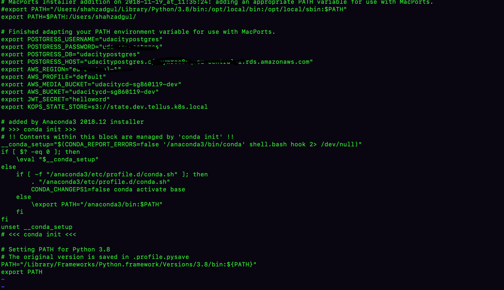
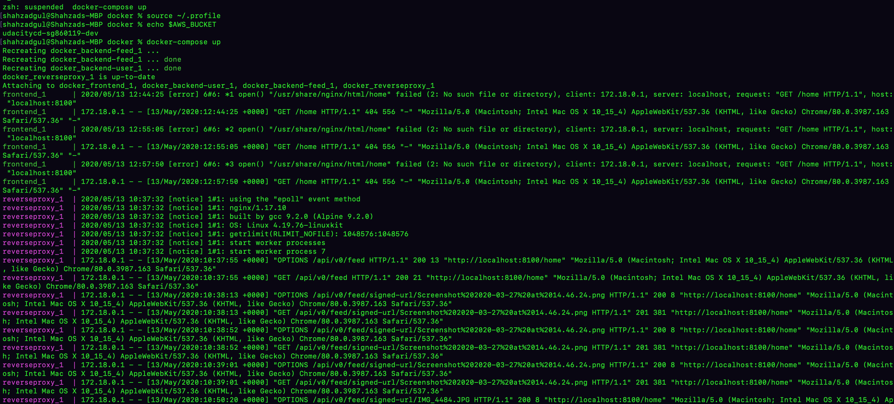
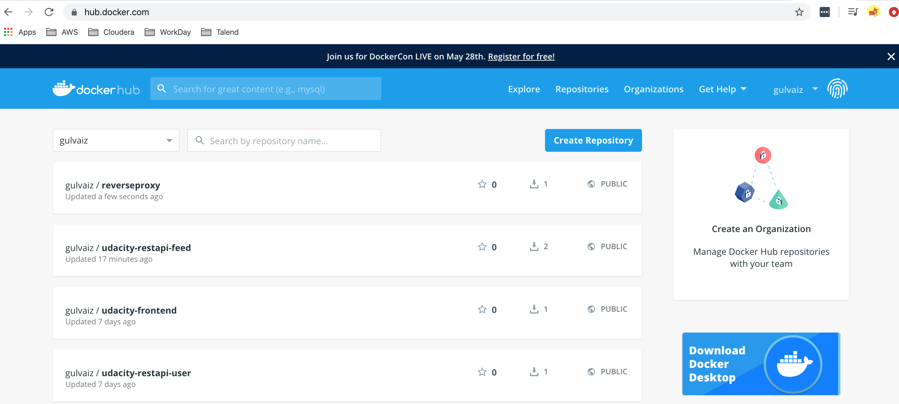
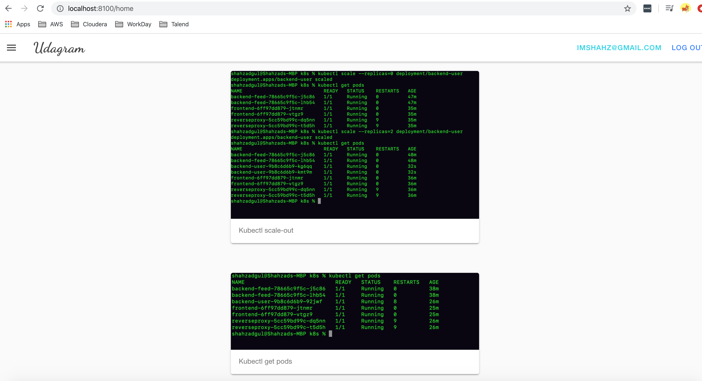
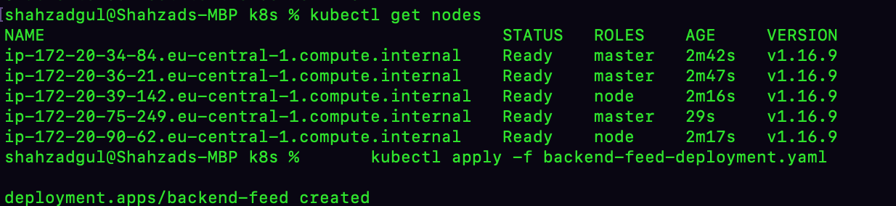
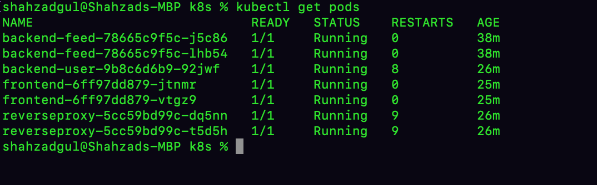
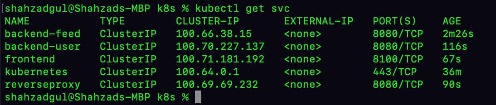
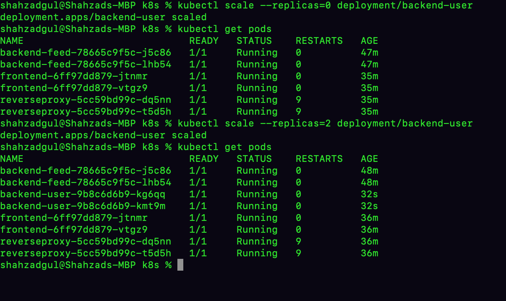
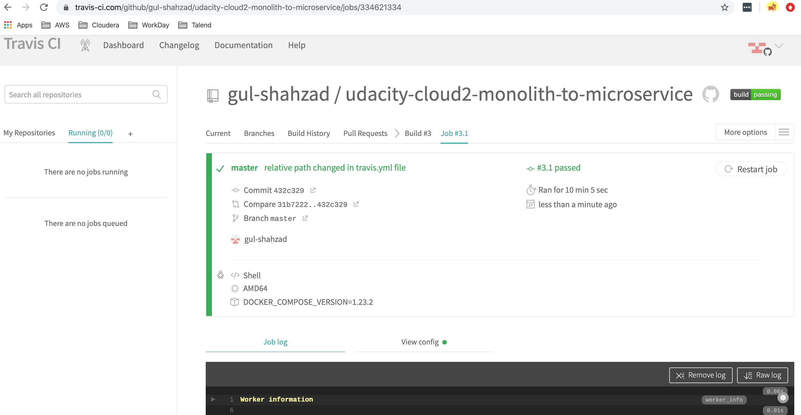

# Udagram Image Filtering Microservice

Udagram is a simple cloud application developed alongside the Udacity Cloud Engineering Nanodegree. It allows users to register and log into a web client, post photos to the feed, and process photos using an image filtering microservice.

The project is split into three parts:
1. [The Simple Frontend](/udacity-c3-frontend)
A basic Ionic client web application which consumes the RestAPI Backend. 
2. [The RestAPI Feed Backend](/udacity-c3-restapi-feed), a Node-Express feed microservice.
3. [The RestAPI User Backend](/udacity-c3-restapi-user), a Node-Express user microservice.

## Getting Setup

> _tip_: this frontend is designed to work with the RestAPI backends). It is recommended you stand up the backend first, test using Postman, and then the frontend should integrate.

### Installing Node and NPM
This project depends on Nodejs and Node Package Manager (NPM). Before continuing, you must download and install Node (NPM is included) from [https://nodejs.com/en/download](https://nodejs.org/en/download/).

### Installing Ionic Cli
The Ionic Command Line Interface is required to serve and build the frontend. Instructions for installing the CLI can be found in the [Ionic Framework Docs](https://ionicframework.com/docs/installation/cli).

### Installing project dependencies

This project uses NPM to manage software dependencies. NPM Relies on the package.json file located in the root of this repository. After cloning, open your terminal and run:
```bash
npm install
```
>_tip_: **npm i** is shorthand for **npm install**

### Setup Backend Node Environment
You'll need to create a new node server. Open a new terminal within the project directory and run:
1. Initialize a new project: `npm init`
2. Install express: `npm i express --save`
3. Install typescript dependencies: `npm i ts-node-dev tslint typescript  @types/bluebird @types/express @types/node --save-dev`
4. Look at the `package.json` file from the RestAPI repo and copy the `scripts` block into the auto-generated `package.json` in this project. This will allow you to use shorthand commands like `npm run dev`


### Configure The Backend Endpoint
Ionic uses enviornment files located in `./src/enviornments/enviornment.*.ts` to load configuration variables at runtime. By default `environment.ts` is used for development and `enviornment.prod.ts` is used for produciton. The `apiHost` variable should be set to your server url either locally or in the cloud.

***
### Running the Development Server
Ionic CLI provides an easy to use development server to run and autoreload the frontend. This allows you to make quick changes and see them in real time in your browser. To run the development server, open terminal and run:

```bash
ionic serve
```

### Building the Static Frontend Files
Ionic CLI can build the frontend into static HTML/CSS/JavaScript files. These files can be uploaded to a host to be consumed by users on the web. Build artifacts are located in `./www`. To build from source, open terminal and run:
```bash
ionic build
```
***

## Deployment


### Virtual environment
In order to separate your environment from other application on your system you ceate a profile. 
python3 -m venv ~/.venv
source ~/.venv/bin/activate
Here you can also create the configurtion such as database details, S3 details etc to avoid them inside project. Later in K8s you can configure the same through configmaps and secrets. 



### Prerequisites

Before we start with deployment of the application we need to perform following steps as pre-req:

1. Create S3 bucket that contains the images stored on application. Make is publically accessible and set CORS as shown below. 
<?xml version="1.0" encoding="UTF-8"?>
<CORSConfiguration xmlns="http://s3.amazonaws.com/doc/2006-03-01/">
<CORSRule>
    <AllowedOrigin>*</AllowedOrigin>
    <AllowedMethod>POST</AllowedMethod>
    <AllowedMethod>GET</AllowedMethod>
    <AllowedMethod>PUT</AllowedMethod>
    <AllowedMethod>DELETE</AllowedMethod>
    <AllowedMethod>HEAD</AllowedMethod>
    <AllowedHeader>*</AllowedHeader>
</CORSRule>
</CORSConfiguration>

2. Create S3 bucket that will hold the state of the cluster. I created the s3 "state.dev.tellus.k8s.local". Once created you configure it as a environmental variable to avoid providing this information with commands. 
export KOPS_STATE_STORE=s3://state.dev.tellus.k8s.local. I added it in ~/.venv file. 
3. Create RDS Posgtres database and set the endpoint, instance name, password in ~/.venv file. Later in Kubernetes deployment you need to set them in configmaps and secrets.  
4. Create Route53 host zone, for details please refer to Kops setup instructions for kubernestes. 


### Docker
You can deploy docker locally on your system. Following command can be used for Feed service. Change it accordingly for other services.  
```bash
docker run --rm --publish 8080:8080 -v $HOME/.aws:/root/.aws --env POSTGRESS_HOST=$POSTGRESS_HOST --env POSTGRESS_USERNAME=$POSTGRESS_USERNAME --env POSTGRESS_PASSWORD=$POSTGRESS_PASSWORD --env POSTGRESS_DB=$POSTGRESS_DB --env AWS_REGION=$AWS_REGION --env AWS_PROFILE=$AWS_PROFILE --env AWS_BUCKET=$AWS_BUCKET --env JWT_SECRET=$JWT_SECRET --name feed gulvaiz/udacity-restapi-feed
```

Once the images are publish, use the following commands if you want to remove any container. 

```bash
docker container ls
docker container kill <container_name>
docker container prune
```

In this project, we have used docker compose to build and push the Docker images. 

1. Build the images: 
        ```bash
        docker-compose -f docker-compose-build.yaml build --parallel
        ```
2. Push the images: 
        ```bash
        docker-compose -f docker-compose-build.yaml push        
        ```
3. Run the container: 
        ```bash
        docker-compose up
        ```



You can verify afterwards in Docker hub to ensure the images are registered. 



Ensure that images can be pulled by running the following command
        ```bash
        docker pull IMAGE_NAME        
        ``` (In my case it is: gulvaiz/udacity-restapi-feed)


The application should be now running on Docker container, as shown below. 



### Kubernetes
There are many frameworks available to deploy kubernetes in AWS, I have used Kops for kubernetes deployment.
 [Here](https://kubernetes.io/docs/setup/production-environment/tools/kops/) you can find a guide on it. I also find [this](https://www.poeticoding.com/create-a-high-availability-kubernetes-cluster-on-aws-with-kops/) article very useful for step-by-step instructions. 

 Run following command to setup kubernetes cluster. 

```bash
kops create cluster \
       --state "s3://state.dev.tellus.k8s.local" \
       --zones "eu-central-1a,eu-central-1b"  \
       --master-count 3 \
       --master-size=t2.medium \
       --node-count 2 \
       --node-size=t2.medium \
       --name dev.tellus.k8s.local \
       --yes
```
Run following commands to verify cluster status

```bash
kops validate cluster \
--name dev.tellus.k8s.local
```
To verify the status on nodes
      
```bash
kubectl get nodes
```



Following commands will deploy app services as PODS. 
```bash
kubectl apply -f backend-feed-deployment.yaml
kubectl apply -f backend-user-deployment.yaml
kubectl apply -f reverseproxy-deployment.yaml
kubectl apply -f frontend-deployment.yaml
```

Once deployed, run
```bash
kubectl get pods
```



Following commands will deploy app services which will work as proxy for ports. 
```bash
kubectl apply -f backend-feed-service.yaml
kubectl apply -f backend-user-service.yaml
kubectl apply -f reverseproxy-service.yaml
kubectl apply -f frontend-service.yaml
```

Once deployed, run
```bash
kubectl get svc
```



Deploy configmaps and secrets that contains the required configuration and credentials. 
```bash
kubectl apply -f aws-secret.yaml
kubectl apply -f env-secret.yaml
kubectl apply -f env-configmap.yaml
```

Now all is set, run following commands for port forwarding, both for back-end and front-end. 

```bash
kubectl port-forward service/frontend 8100:8100
kubectl port-forward service/reverseproxy 8080:8080
```

Scaleout and scaledown of one of the microservice. 



Some useful commands for verification. 
```bash
To get deployment status
    kubectl get deployment
Get all deployed replica-sets
    kubectl get rs
Debug Kubernetes
    kubectl describe pods PODNAME
```
Finally you can configure Travis CICD in a way that for each commit in github will trigger the auto deployment of PODS. 




### Tips & tools
During the project I have faced various issues. Below I have provided tips to avoid them and tools which can be very handy during development and deployment phase.  

* Some of kubernetes pods got stuck in "Pending" state. I used "Kubectl describe pods ID" to troubleshoot the cause. In my case it was low CPU. I changed the requests CPU and limit CPU values in K8s deployment yaml files. This worked perfectly afterwards. 
* To check values in Postgres database I used a utility "Postbird"